## 1. 概念

随着开发经验的积累，我们会逐渐形成一些**常见的代码结构或解决问题的方法**，这些就被称为"**模式**"，我们可以在开发中**重复利用**这些模式。1995 年，*Eric Gamma*、*Richard Helm*、*Ralph Johnson*、*John Vlissides*等人被称为“四人组”（Gang of Four，简称GoF），他们将开发者们这种经验总结整理成了一种称为“设计模式”的概念。并在 **[《设计模式：可复用面向对象软件的基础》](https://book.douban.com/subject/34262305/)** 一书中详细介绍了23种常见的设计模式。

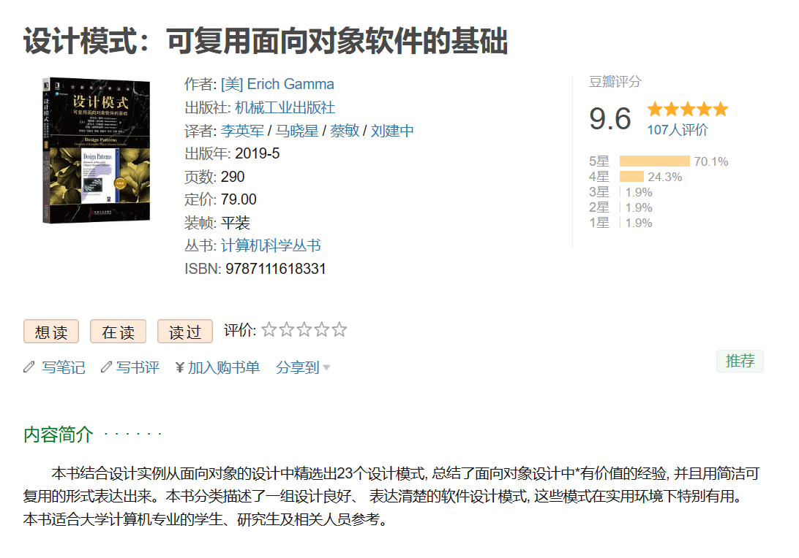

所以，什么是设计模式？

**简单来说，设计模式（Design Pattern）就是一套被反复使用、多数人知晓、经过分类编目的代码设计经验的总结**。

使用设计模式是为了可重用代码、让代码更容易被他人理解、保证代码可靠性。换句话说，设计模式是一种通用的解决问题的方法，它提供了在特定情境下解决一般问题的模板。

> “A pattern is a **solution** to a problem in a **context**”

设计模式就是从许多优秀的软件系统中总结出的成功的、能够实现可维护性复用的设计方案，它为开发人员提供了可以共享经验和理解的词汇，使得他们可以更加容易地沟通和理解彼此的想法。

**在这里，我们将逐一学习 GoF 的23种设计模式，使用的语言是 Java**。

## 2. 分类

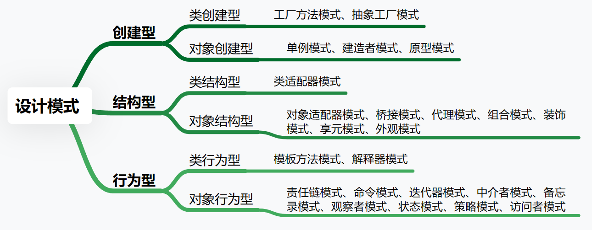

### 2.1 使用目的

根据设计模式使用目的，我们可以将其分为三种，分别是创建型、结构型与行为型。

#### 2.1.1 创建型模式

创建型设计模式**主要关注对象的创建过程**，其核心思想是通过提供一种机制来封装对象的实例化过程，以便在系统中某个地方只需指定其相关的类，也就是我们所说的，**将对象的创建和使用分离，降低耦合度**。

>
> 在设计和编写代码时，我们通常希望各个模块、类或函数之间的耦合度尽可能低，这样可以使得代码更易于理解、测试和维护。**降低耦合度，指的是减少程序中各个部分之间的依赖关系**。
>
> 简单来说，如果一个模块的修改导致其他很多模块也需要修改，那么我们就说这些模块之间的耦合度很高。
>
> 降低耦合度的方法有很多，例如使用接口或抽象类来定义行为，使用依赖注入来提供依赖，使用事件或回调来进行异步通信等。设计模式就是一种有效的降低耦合度的方案，它们提供了一种结构化的方式来组织和解耦代码。
>

属于创建型模式的设计模式如下所示：

| 模式                                            | 描述                                                                               |
| ----------------------------------------------- | ---------------------------------------------------------------------------------- |
| [工厂方法模式](./note/创建型模式/2_工厂方法.md) | 定义一个创建对象的接口，让子类决定实例化哪一个类，工厂方法让类的实例化推迟到子类。 |
| [抽象工厂模式](./note/创建型模式/3_抽象工厂.md) | 提供一个接口，用于创建相关或依赖对象的家族，而不需要明确指定具体类。               |
| [单例模式](./note/创建型模式/4_单例.md)         | 确保一个类只有一个实例，并提供一个全局访问点。                                     |
| [建造者模式](./note/创建型模式/6_建造者.md)     | 将一个复杂对象的构建与它的表示分离，使得同样的构建过程可以创建不同的表示。         |
| [原型模式](./note/创建型模式/5_原型.md)         | 通过复制现有的实例来创建新的实例，而不是通过新建类。                               |

#### 2.1.2 结构型模式

结构型模式主要关注**如何通过类和对象的组合布局形成复杂的系统**，提高系统的模块化和灵活性。通过继承和关联，可以在不同地方复用已有的代码，减少重复编写。

以下模式属于结构型设计模式：

| 模式                                             | 描述                                                                                                     |
| ------------------------------------------------ | -------------------------------------------------------------------------------------------------------- |
| [外观模式](./note/结构型模式/01_外观模式.md)     | 为子系统中的一组接口提供一个统一的接口，外观模式定义了一个高层接口，这个接口使得这一子系统更加容易使用。 |
| [适配器模式](./note/结构型模式/02_适配器模式.md) | 允许将一个类的接口转换成客户希望的另一个接口，使得原本由于接口不兼容而不能一起工作的那些类可以一起工作。 |
| [组合模式](./note/结构型模式/03_组合模式.md)     | 将对象组合成树形结构以表示“部分-整体”的层次结构，使得用户对单个对象和组合对象的使用具有一致性。          |
| [代理模式](./note/结构型模式/04_代理模式.md)     | 为其他对象提供一种代理以控制对这个对象的访问。                                                           |
| [桥接模式](./note/结构型模式/05_桥接模式.md)     | 将抽象部分与它的实现部分分离，使它们都可以独立地变化。                                                   |
| [装饰模式](./note/结构型模式/06_装饰模式.md)     | 动态地给一个对象添加一些额外的职责，就增加功能来说，装饰器模式比生成子类更为灵活。                       |
| [享元模式](./note/结构型模式/07_享元模式.md)     | 运用共享技术有效地支持大量细粒度的对象。                                                                 |

#### 2.1.3 行为型模式

行为型设计模式主要**关注对象之间的交互以及对象如何相互协作来完成复杂的任务**，提供了一种方式来抽象化对象之间的常见交流模式，从而实现对象间的高效通信和责任分配。

以下模式属于行为型设计模式：

| 模式                                                 | 描述                                                                                                                                             |
| ---------------------------------------------------- | ------------------------------------------------------------------------------------------------------------------------------------------------ |
| [策略模式](./note/行为型模式/01_策略模式.md)         | 定义一系列的算法，把它们一个个封装起来，并使它们可以相互替换。                                                                                   |
| [模板方法模式](./note/行为型模式/02_模板方法模式.md) | 定义一个操作中的算法的骨架，而将一些步骤延迟到子类中，使得子类可以不改变一个算法的结构即可重定义该算法的某些特定步骤。                           |
| [中介者模式](./note/行为型模式/03_中介者模式.md)     | 用一个中介对象来封装一系列的对象交互，中介者使各对象不需要显式地相互引用，从而使其耦合松散，而且可以独立地改变它们之间的交互。                   |
| [观察者模式](./note/行为型模式/04_观察者模式.md)     | 定义对象间的一种一对多的依赖关系，当一个对象的状态发生改变时，所有依赖于它的对象都得到通知并被自动更新。                                         |
| [迭代器模式](./note/行为型模式/05_迭代器模式.md)     | 提供一种方法顺序访问一个聚合对象中各个元素，而又不暴露该对象的内部表示。                                                                         |
| [备忘录模式](./note/行为型模式/06_备忘录模式.md)     | 在不破坏封装的前提下，捕获一个对象的内部状态，并在该对象之外保存这个状态，这样以后就可将该对象恢复到原先保存的状态。                             |
| [状态模式](./note/行为型模式/07_状态模式.md)         | 允许一个对象在其内部状态改变时改变它的行为，对象看起来似乎修改了它的类。                                                                         |
| [命令模式](./note/行为型模式/08_命令模式.md)         | 将一个请求封装为一个对象，从而使你可用不同的请求对客户进行参数化；对请求排队或记录请求日志，以及支持可撤销的操作。                               |
| [责任链模式](./note/行为型模式/09_责任链模式.md)     | 使多个对象都有机会处理请求，从而避免请求的发送者和接收者之间的耦合关系。将这些对象连成一条链，并沿着这条链传递该请求，直到有一个对象处理它为止。 |
| [访问者模式](./note/行为型模式/10_访问者模式.md)     | 表示一个作用于某对象结构中的各元素的操作，它使你可以在不改变各元素的类的前提下定义作用于这些元素的新操作。                                       |
| [解释器模式](./note/行为型模式/11_解释器模式.md)     | 给定一个语言，定义它的文法的一种表示，并定义一个解释器，这个解释器使用该表示来解释语言中的句子。                                                 |

### 2.2 应用范围

根据模式处理的范围，即用于处理类之间关系还是处理对象之间的关系，可分为类模式和对象模式。

#### 2.2.1 类模式

类模式主要关注类和子类的设计，它们通过继承、静态方法等方式来创建能够共享相同行为的类结构，在编译时确定类之间的关系。

> 类模式的结构很清晰，更侧重于静态的类结构和继承机制，构建稳定的系统架构。

- **优点**：结构清晰，易于理解和使用；利用继承实现代码复用。
- **缺点**：过度使用继承可能导致类层次结构复杂，难以维护；继承是静态的，不够灵活。

#### 2.2.1 对象模式

对象模式主要关注对象之间的关系，它们通过接口、组合、委托等方式在运行时确定对象之间的关系。

> 对象模式通过关联对象来解决问题，强调对象间的协作和通信，侧重于对象的动态行为和对象间的相互作用，灵活组合对象来实现需求。

- **优点**：提高了系统的灵活性和可扩展性；降低了对象间的耦合度。
- **缺点**：可能会增加系统的复杂性，因为需要管理更多的对象关系；动态组合可能导致性能问题。

## 3. 优势

设计模式的应用能提高代码复用性和开发效率，使得代码在面对功能添加或修改时，对现有代码的影响降至最低，提高了代码的可维护性和系统的易扩展性。

学习设计模式能帮助我们以全新的角度审视代码，开发出更易复用和扩展的软件。设计模式的使用不仅提升了软件系统的开发效率和质量，降低了设计成本，也使设计方案更灵活，易于修改。

此外，设计模式还能帮助初学者深入理解面向对象思想，提高软件设计水平和代码质量。

## 4. 创建型设计模式

### [工厂方法模式](./note/创建型模式/2_工厂方法.md)

定义一个用于创建对象的接口，让子类决定实例化哪一个类，将类的实例化操作延迟到子类中完成。

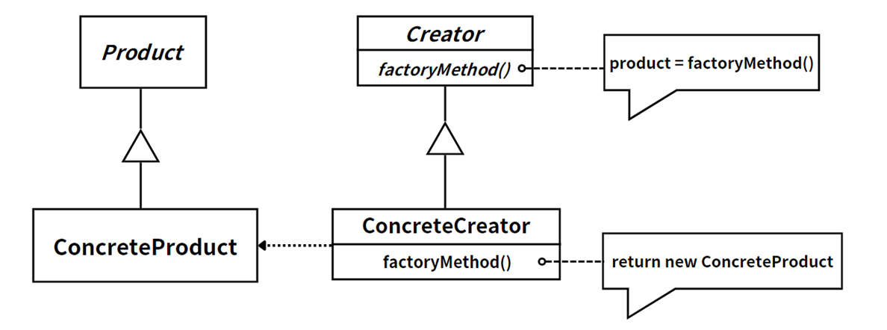

### [抽象工厂模式](./note/创建型模式/3_抽象工厂.md)

提供一个创建一系列相关或相互依赖对象的接口，而无需指定它们具体的类。

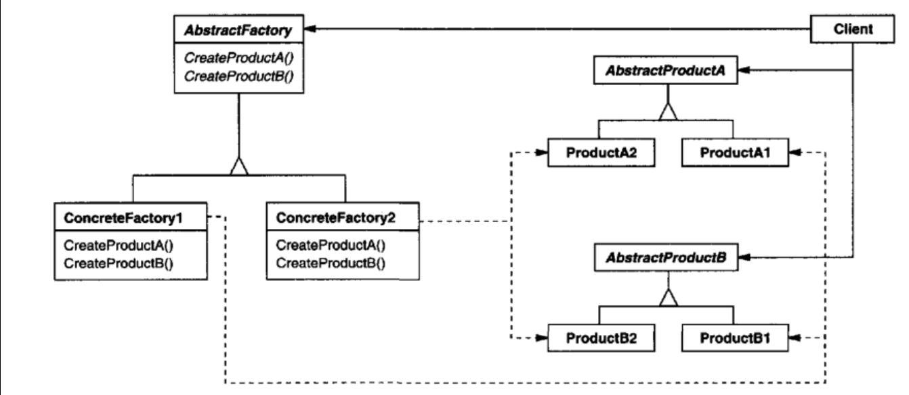

### [单例模式](./note/创建型模式/4_单例.md)

确保一个类只有一个实例，并提供一个全局访问点来访问这个唯一实例。

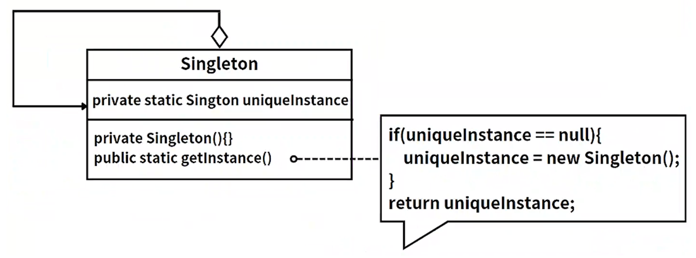

### [原型模式](./note/创建型模式/5_原型.md)

采用原型实例指定创建对象的种类，并且通过拷贝这些原型创建新的对象。原型模式允许一个对象再创建另外一个可定制的对象，无需知道任何创建的细节。

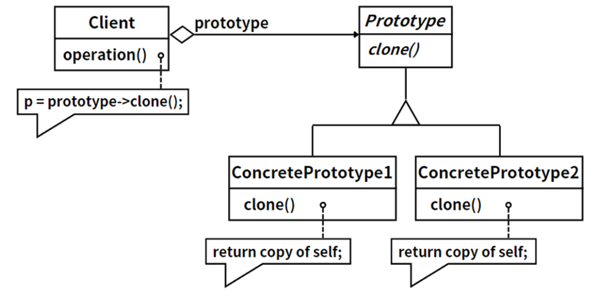

### [建造者模式](./note/创建型模式/6_建造者.md)

将一个复杂对象的构建与它的表示分离，使得同样的构建过程可以创建不同的表示。

## 5. 结构型模式

### [外观模式](./note/结构型模式/01_外观模式)

外部与一个子系统的通信必须通过一个统一的外观对象进行，为子系统中的一组接口提供一个一致的界面。

### [适配器模式](./note/结构型模式/02_适配器模式.md)

将一个接口转换成客户希望的另一个接口，适配器模式使接口不兼容的那些类可以一起工作。

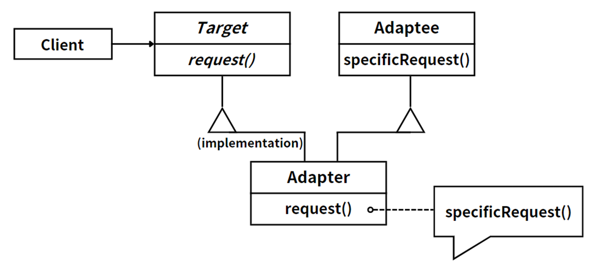

类适配器模式。

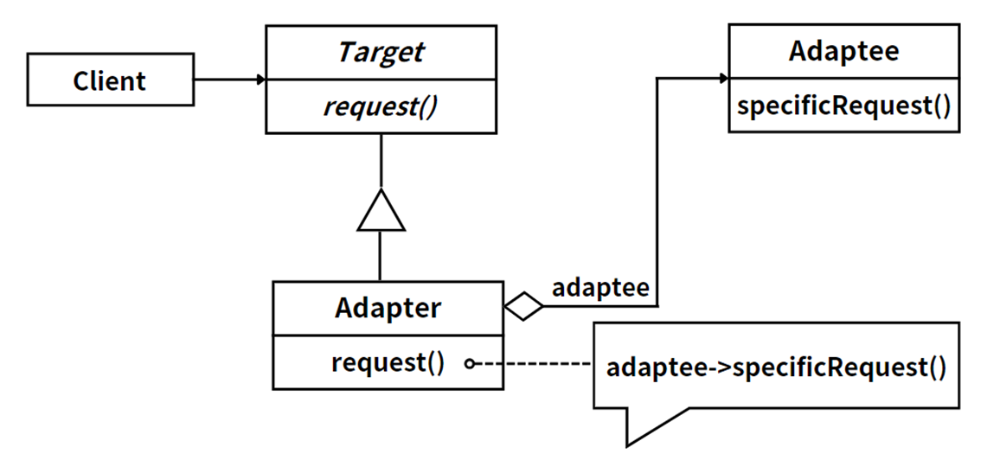

对象适配器模式。

### [组合模式](./note/结构型模式/03_组合模式.md)

组合多个对象形成树形结构，以表示具有部分—整体关系的层次结构。

### [代理模式](./note/结构型模式/04_代理模式.md)

给某一个对象提供一个代理，并由代理对象控制对原对象的引用。

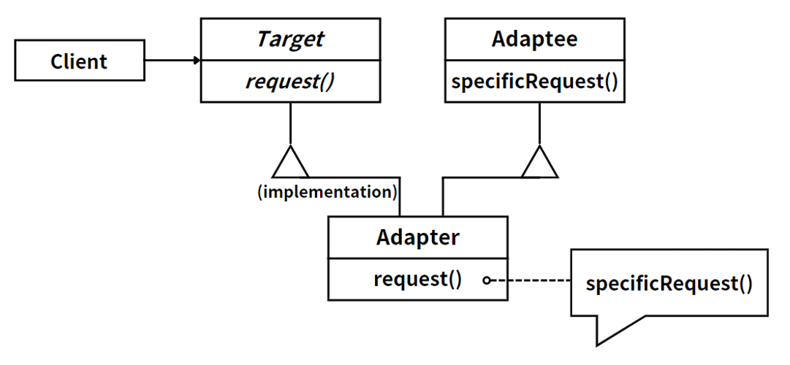

### [桥接模式](./note/结构型模式/05_桥接模式.md)

将抽象部分与它的实现部分分离，使它们都可以独立地变化。

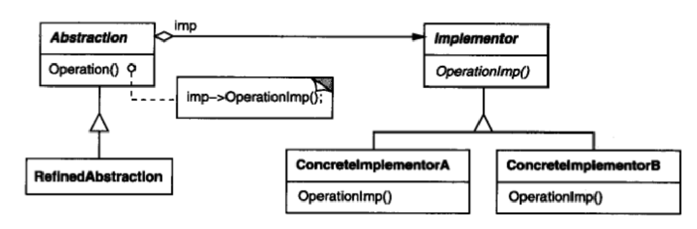

### [装饰模式](./note/结构型模式/06_装饰模式.md)

不改变原有对象的前提下，动态地给一个对象增加一些额外的功能。

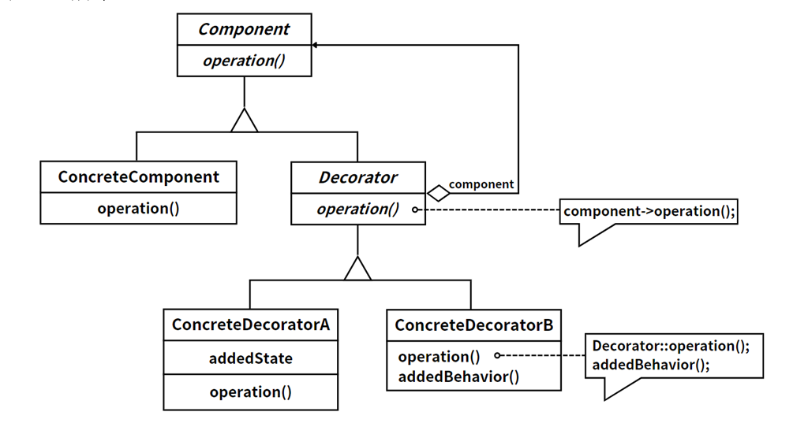

### [享元模式](./note/结构型模式/07_享元模式.md)

运用共享技术有效地支持大量细粒度对象的复用。

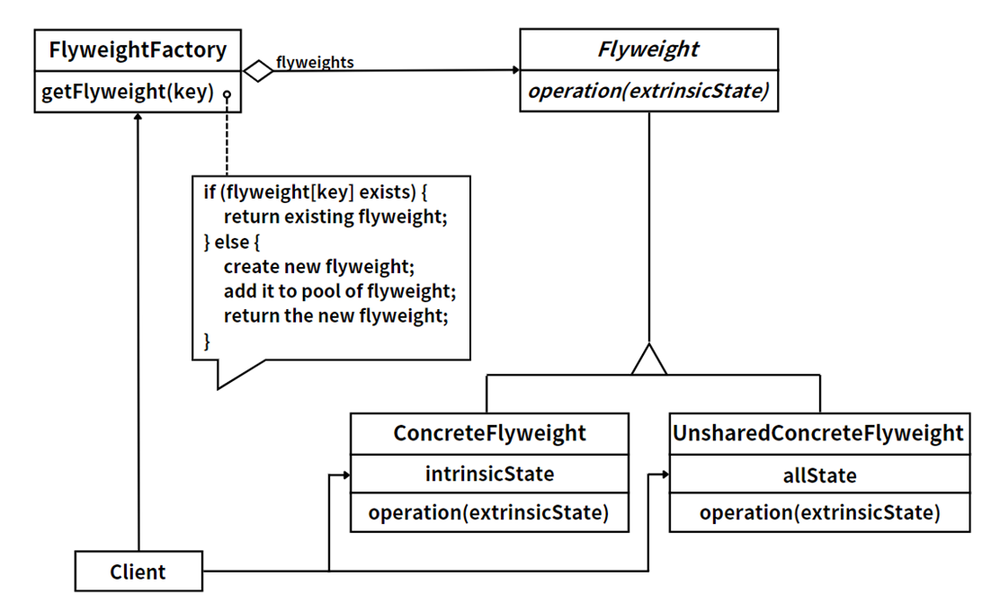

## 6. 行为型模式

### [策略模式](./note/行为型模式/01_策略模式.md)

定义一系列算法，将每一个算法封装起来，并让它们可以相互替换。

### [模板方法模式](./note/行为型模式/02_模板方法模式.md)

定义一个操作中算法的骨架，而将一些步骤延迟到子类中。

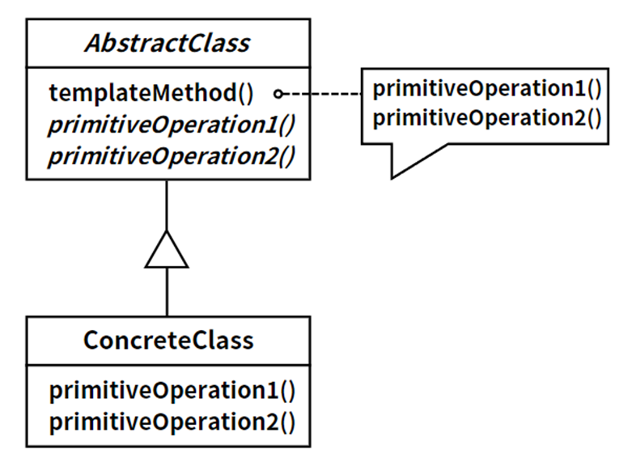

### [中介者模式](./note/行为型模式/03_中介者模式.md)

用一个中介对象来封装一系列的对象交互，使各对象不需要显式地相互引用，从而使其耦合松散。

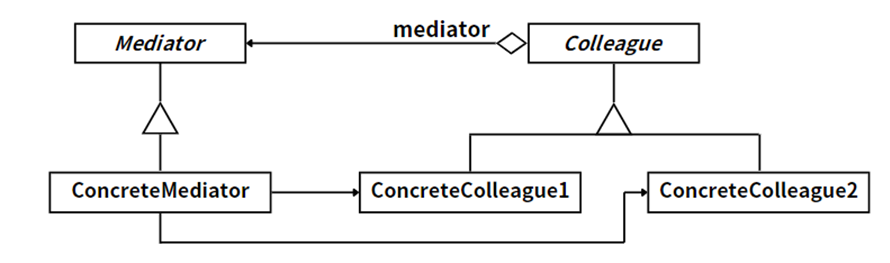

### [观察者模式](./note/行为型模式/04_观察者模式.md)

定义对象间的一种一对多的依赖关系，使得每当一个对象改变状态，则所有依赖于它的对象都会得到通知并自动更新。

### [迭代器模式](./note/行为型模式/05_迭代器模式.md)

提供一种方法顺序访问一个聚合对象中的各个元素，而又不需要暴露该对象的内部表示。

### [备忘录模式](./note/行为型模式/06_备忘录模式.md)

在不破坏封装性的前提下，捕获一个对象的内部状态，并在该对象之外保存这个状态，以便以后恢复该对象到之前的状态。

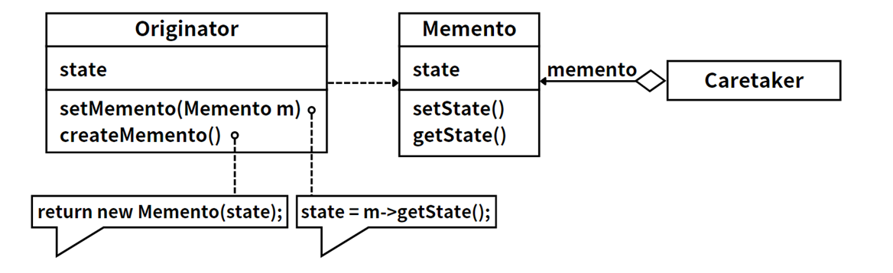

### [状态模式](./note/行为型模式/07_状态模式.md)

允许一个对象在其内部状态改变时改变其行为，看起来对象好像修改了其类。

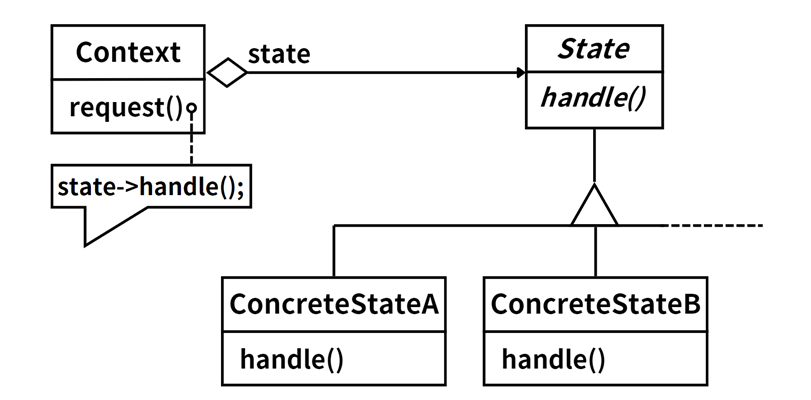

### [命令模式](./note/行为型模式/08_命令模式.md)

将一个请求封装为一个对象，可以用不同的请求对客户进行参数化；对请求排队或记录请求日志，以及支持可撤销的操作。

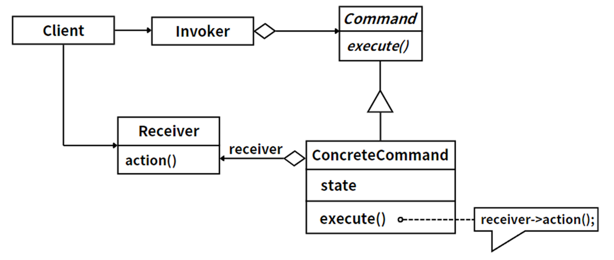

### [责任链模式](./note/行为型模式/09_责任链模式.md)

为解除请求的发送者和接收者之间的耦合，使多个对象都有机会处理这个请求，将这些对象连成一条链，并沿着这条链传递该请求，直到有一个对象处理它为止。

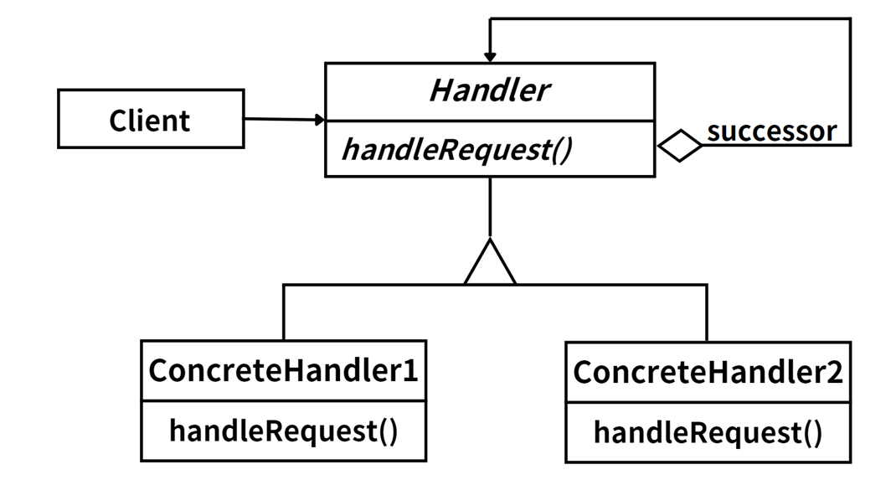

### [访问者模式](./note/行为型模式/10_访问者模式.md)

表示一个作用于某对象结构中的各元素的操作。它使您可以在不改变各元素的类的前提下定义作用于这些元素的新操作。

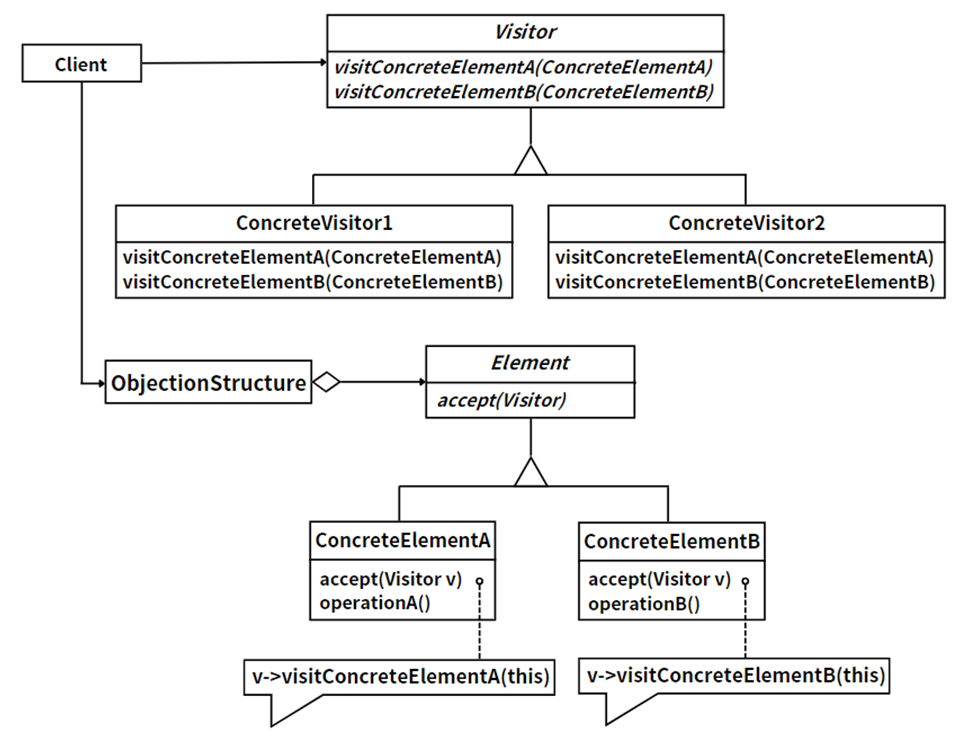

### [解释器模式](./note/行为型模式/11_解释器模式.md)

给定一种语言，定义它的文法的一种表示，并定义一个解释器，这个解释器使用该表示来解释语言中的句子。

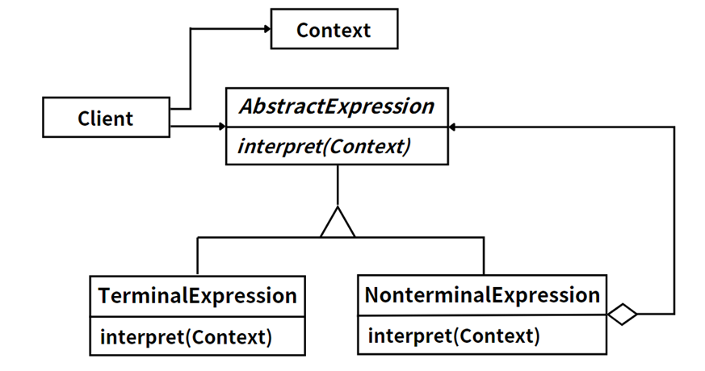

